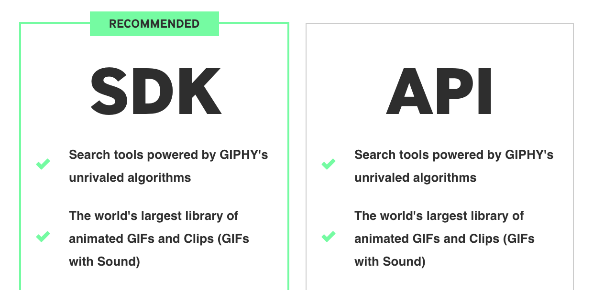
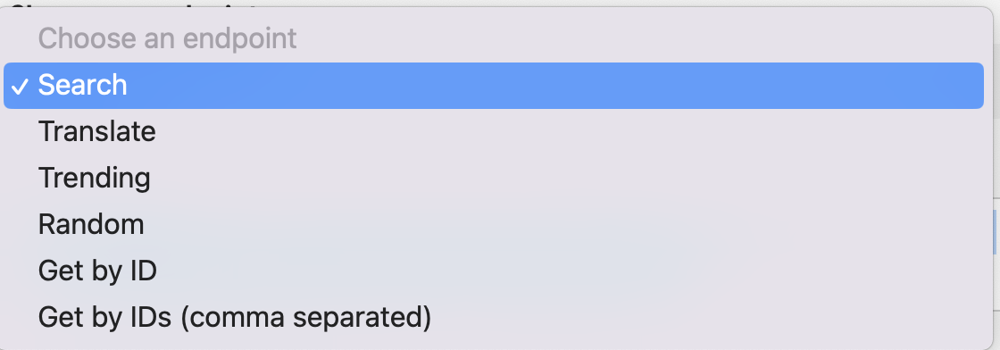
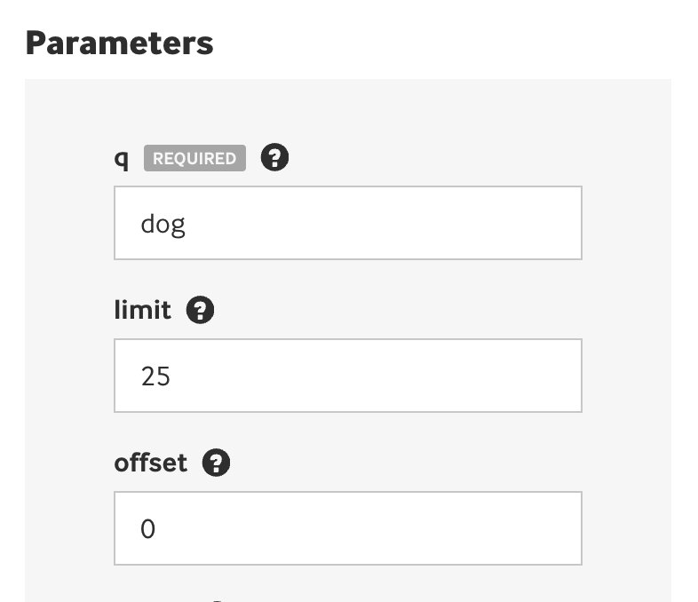

# Async Giphy

Who doesn't love a good gif?  


**GOAL:** Today you will be getting creating an application that utilizes [fetch to an image from Giphy](https://developers.giphy.com/). We will be able to request an image from Giphy and then get back a gif to match this query.

## Setup

1. Install the dependencies by running:
```shell
npm install
```

## Create a Giphy API Key

Many website have Application Program Interfaces (APIs) that allow you to request data and return this data back to be used in your applications. Some APIs, like the [PokeAPI](https://pokeapi.co/api/v2/pokemon/140), return the data so long as you have the URL. However, this can lead to some security issues as the organization does not know who is requested the data. 

**API Keys** allow for applications to authenticate an application or user that is requesting data.

1. Go to https://developers.giphy.com/.
2. Login or create a developer account.
3. Click "**Create an App**". 


4. Select the "SDK" Option



5. Give your application name (e.g. "Giphy Async Practice") and description (e.g "Learning about async functions") you like.

> You should never save sensitive values, like an API key, in a file that could be committed to GitHub. We save these files in a `.env` file as this is ignored typically with our `.gitignore` file.

6. Copy the API key and save the value in your .env file in the API_KEY variable.


```Plain Text
# .env variable
API_KY = "abcd123456789"
```

## API Endpoint

Giphy has a very useful API Explorer that lets you preview the values that will be returned from your requested endpoint.

1. Navigate the "API Explorer"


2. Choose an endpoint of Search



3. Type a hardcoded query in the `q REQUIRED` field under **Parameters**. Notice that the Request URL update the `q = ` value as you type this.



4. Click "**Send Request**" to see the expected endpoint.


5. Notice that the **Request URL** has the API contained within the URL! Copy the **Request URL** and save it in a variable called endpoint in your index.js.

## Accessing Environment Variables

1. To access an environment variable you simply need to call `process.env.API_KEY` in `index.js`. An example call has already been created for you!
2. Interpolate this in to your request URL.

```JavaScript
const endpoint = `https://api.giphy.com/v1/gifs/search?api_key=${process.env.API_KEY}&q=dogs&limit=25&offset=0&rating=g&lang=en`
```

## getImage(query)

**GOAL**: Create an asynchronous `getImages(query)` function that creates a `fetch` request to the API endpoint that returns a URL link to a gif that matches the search value.

1. Declare an asynchronous function `getImage(query)`.
2. Create a `fetch` request to the endpoint. Don't forget to `await` the result!
3. Parse the data using `.json()`. Don't forget to `await` the result!
4. Save the URL of a single gif image from the JSON object in a variable. Print this value to the console to ensure you get a link that works!
5. Refactor the endpoint so that `q=dogs` contains the value you are searching for with `query`.
6. Return the image from the function.

## Extensions 🚀

You now have the power of the entire Giphy library, the opportunities are endless. Here are a few extensions you can explore.

1. Instead of getting the first image, get a random image from the response object. There are 25 images in the default response object. Randomly return this gif
2. Iterate through the response object and save all 25 images an array. 
    - **NOTE**: You will need to create an asynchronous helper function that invokes your getImage so that you can access returned value.
    ```JavaScript
    async function helperFunction() {
        await getImage("dogs");
    }
    ```
> We have not learned about web servers yet so `.env` variables will not work for this part. Simply don't commit your API Key to GitHub for now. You can research how to incorporate secrets, but it is far outside the scope of this practice!
3. Create a user interface. One possible way you can do this:
    - Create `index.html` and `style.css` files.
    - Create and style a button.
    - Attach an `addEventListener` to the button that calls the `getImage(query)` function with some hard coded value
    - Output the returned URL to the screen in an `` tag using `document.querySelector()` and `innerHTML`.
4. Incorporate search functionality on your user interface so that a user can search for any image. One possible way to do this:
    - Create an HTML form that has an `<input>` element. This will be where the user can type their search.
    - Research how to get values from a form when they are submitted. The value should be used to call `getImage(query)` with `query` being the searched value.
    - Output the result of the search to the screen.
5. Output all 25 images to the page when they search for them rather than a single image.